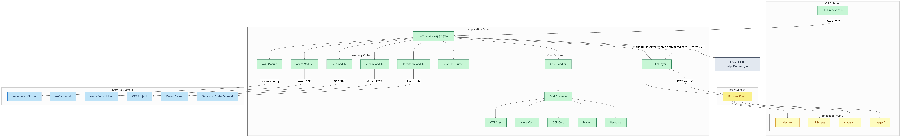

# Kollect

Kollect is a tool for collecting and displaying data from Kubernetes clusters, AWS, and Azure resources. It provides a web interface to visualize various resources and allows exporting the collected data as a JSON file.

## Features

- Collects data from Kubernetes clusters
- Collects data from AWS resources (EC2, S3, RDS, DynamoDB, VPCs)
- Collects data from Azure resources (VMs, Storage Accounts, Blob Storage, Virtual Networks, SQL Databases, File Shares, CosmosDB)
- Displays data in a web interface
- Supports exporting data as a JSON file

## Diagram 


[GitDiagram provided the ability to create the above diagram](https://gitdiagram.com/michaelcade/kollect)

## Resources 
- [Kollect - The Cloud Inventory Project](https://youtu.be/dfuQFjl1Tnw)
- [Kollect - Veeam Inventory](https://youtu.be/yQ1vlndXTQY)
- [Kollect - A Cloud & Kubernetes Inventory tool](https://community.veeam.com/kubernetes%2Dkorner%2D90/kollect%2Da%2Dcloud%2Dkubernetes%2Dinventory%2Dtool%2D8885)
- [Kollect: A Modern Take on RVTools for Cloud Environments](https://community.veeam.com/kubernetes-korner-90/kollect-a-modern-take-on-rvtools-for-cloud-environments-9472?tid=9472&fid=90)


## Installation

To install Kollect, clone the repository and build the binary:

```sh
git clone https://github.com/michaelcade/kollect.git
cd kollect
go build -o kollect ./cmd/kollect
```

## Usage

Run the Kollect binary with the desired flags:

```sh
./kollect [flags]
```

### Flags

- `--inventory`: Type of inventory to collect (kubernetes/aws/azure)
- `--storage`: Collect only storage-related objects (default: false)
- `--kubeconfig`: Path to the kubeconfig file (default: $HOME/.kube/config)
- `--browser`: Open the web interface in a browser (default: false)
- `--output`: Output file to save the collected data
- `--help`: Show help message

### Examples

Collect data from a Kubernetes cluster and display it in the terminal:

```sh
./kollect --inventory kubernetes
```

Collect data from AWS resources and display it in the terminal:

```sh
./kollect --inventory aws
```

Collect data from Azure resources and display it in the terminal:

```sh
./kollect --inventory azure
```

Collect data from a Kubernetes cluster and open the web interface:

```sh
./kollect --inventory kubernetes --browser
```

Collect data from AWS resources and save it to a file:

```sh
./kollect --inventory aws --output aws_data.json
```

## Development

### Project Structure

```
.DS_Store
.github/
    workflows/
        release.yaml
.gitignore
api/
    .DS_Store
    v1/
        k8sdata.go
cmd/
    .DS_Store
    kollect/
        main.go


go.mod


go.sum


LICENSE
pkg/
    .DS_Store
    aws/
        inventory.go
    azure/
        inventory.go
    kollect/
        kollect.go


README.md


test/
    kollect_test.go
web/
    .DS_Store
    index.html
```

### Building the Project

To build the project, run the following command:

```sh
go build -o kollect ./cmd/kollect
```

### Running Tests

To run the tests, use the following command:

```sh
go test ./...
```

## Contributing

We welcome contributions to Kollect! Please open an issue or submit a pull request on GitHub.

## License

Kollect is licensed under the MIT License. See the [LICENSE](LICENSE) file for more information.
```